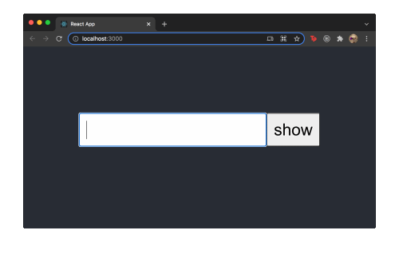

# usePassword



## Installation

```bash
$ npm install react-use-password
```

## API

```js
const { passwordValue, onPasswordChanged } = usePassword();
```

You can destructuring `passwordValue` it has `password` and `passwordHidden`

**password** = password that show `•` in input field

**passwordHidden** = real password for use

### Option

you can add an option like this

```js
const { passwordValue, onPasswordChanged } = usePassword({
  length: 2,
  mask: "*",
  timeout: 2000,
});
```

**length** = length of password that show before change to password type

**mask** = symbol that will appear for hide password

**timeout** = timeout for hide password after typed

---

## Example

```jsx
import { usePassword } from "react-use-password";

const App = () => {
  const { passwordValue, onPasswordChanged } = usePassword();

  return (
    <div className="App">
      <header className="App-header">
        <div>
          <input
            name="password"
            onChange={(event) => onPasswordChanged(event)}
            value={passwordValue.password}
          />
        </div>
      </header>
    </div>
  );
};
```

## Type

```jsx
type usePassword = {
  passwordValue: {
    password: string,
    passwordHidden: string,
  },
  onPasswordChanged: (EventTarget) => void,
};
```

---
